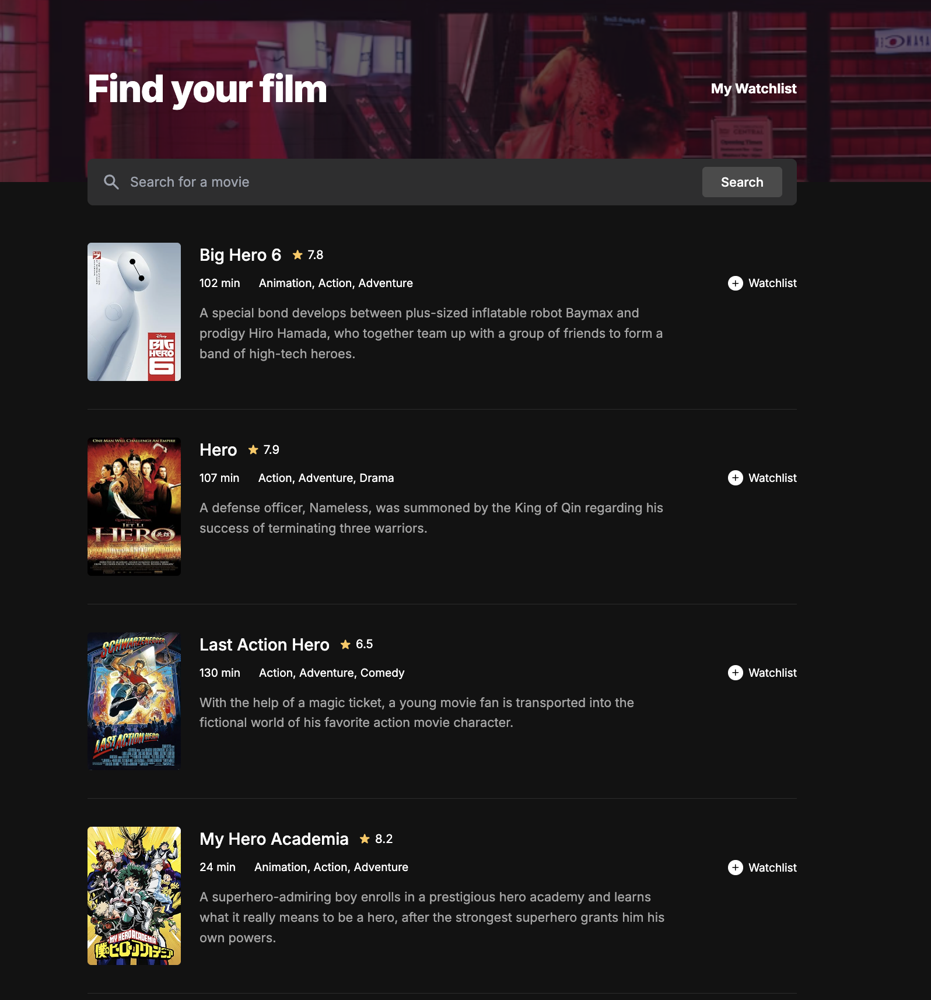

# Movie Watchlist

A personal movie watchlist application that allows users to search for movies, view details, and save their favorites to a local watchlist. Built with vanilla HTML, CSS, and JavaScript using the OMDb API.


## Features

-   **Search Movies**: Search for any movie using the OMDb API.
-   **Random Discovery**: Automatically fetches and displays 5 random movies (based on curated keywords) every time you load the page, so you always have something new to discover.
-   **Watchlist Management**:
    -   Add movies to your personal watchlist.
    -   Remove movies when you're done.
    -   Data is persisted using `localStorage`, so your list is saved even if you refresh or close the browser.
-   **Responsive Design**: A clean, dark-themed UI that works on desktop and mobile.
-   **Dynamic States**: Handles various UI states including:
    -   **Initial/Random Load**: Shows random suggestions.
    -   **Search Results**: Displays detailed movie cards.
    -   **Empty Watchlist**: Friendly placeholder when no movies are saved.
    -   **No Data**: Error handling for failed searches.

## Tech Stack

-   **HTML5**: Semantic structure.
-   **CSS3**: Custom styling with Flexbox/Grid, variables, and responsive media queries.
-   **JavaScript (ES6+)**: Async/await for API calls, DOM manipulation, and LocalStorage management.
-   **API**: [OMDb API](http://www.omdbapi.com/) for movie data.

## Setup & Usage

1.  **Clone the repository**:
    ```bash
    git clone https://github.com/yourusername/movie-wishlist.git
    cd movie-wishlist
    ```

2.  **API Key**:
    -   The project uses a free OMDb API key.
    -   Open `index.js` and look for `const API_KEY`.
    -   *Note: If you plan to deploy this, consider hiding your API key or setting up a proxy.*

3.  **Run Locally**:
    You can open `index.html` directly in your browser, but for the best experience (and to avoid CORS issues depending on browser strictness), use a local server.

    **Using Python:**
    ```bash
    python3 -m http.server 8080
    ```
    Then open [http://localhost:8080](http://localhost:8080) in your browser.

    **Using VS Code Live Server:**
    -   Install the "Live Server" extension.
    -   Right-click `index.html` and select "Open with Live Server".

## Project Structure

```
├── index.html      # Main search page
├── wishlist.html   # Watchlist page
├── index.css       # Global styles
├── index.js        # Search and API logic
├── wishlist.js     # Watchlist display logic
└── README.md       # Project documentation
```

## Future Improvements

-   [ ] Add "Watched" status to watchlist items.
-   [ ] Implement pagination for search results.
-   [ ] Add sorting/filtering options for the watchlist.

## License

This project is open source and available under the [MIT License](LICENSE).
